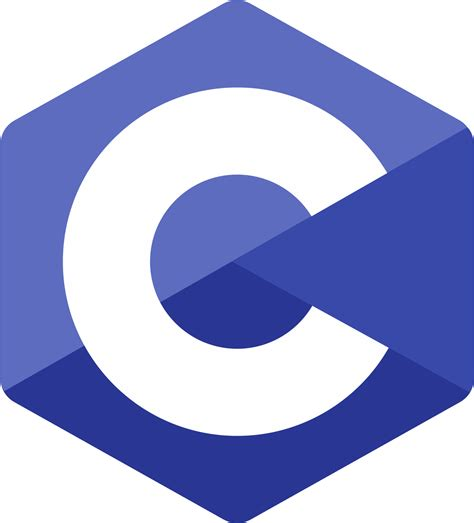
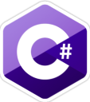
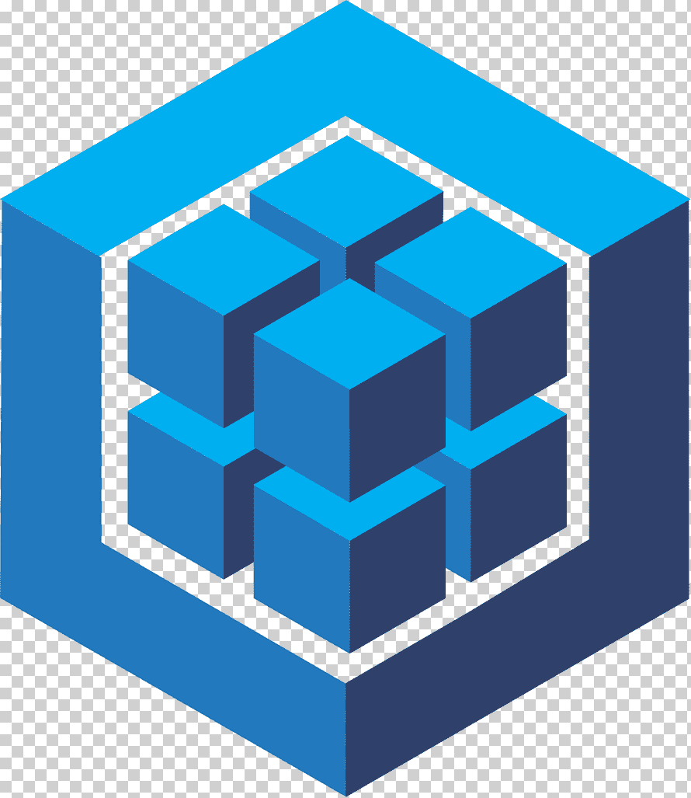

### Hi there, I'm Austin Slater! 👋

I'm a Full-Stack Web Developer based in Minnesota, United States. I enjoy building web applications and exploring new technologies. Here's a bit about me:

- 🔭 I’m currently working as a Developer & NetSuite Administrator for Waldoch Crafts.
- 🌱 I’m constantly learning and improving my skills in web and software development.
- 🎓 I have many certificates in programming.
- ⚡ Fun fact: In my free time, you can find me fishing in the 'Land of 10,000 Lakes.'

### Get in Touch

Feel free to connect with me on LinkedIn and send me a private message. I'm always open to interesting projects and collaborations.

<!--  -->

<!-- -->

 

### Skills

Thanks for visiting my GitHub profile! 😄
